# Task 1 Report — Data Understanding & Related Work

**Group12 · ICE478 Summer 2026 · Track 3 (CNN + Attention) · Dataset: MaleBin**

---

## 1. Dataset

| Property | Value |
|---|---|
| Name | MaleBin: Malware Binary Greyscale Images |
| Source | Kaggle `tashiee/malebin-malware-binary-greyscale-images` (CC BY 4.0) |
| Compiled from | Malimg (Nataraj et al., VizSec 2011) + a subset of `walt30/malware-images` (MalwareBazaar) |
| Application area | Static malware family triage from byte-plot images (cyber security) |
| Problem type | Single-label multi-class image classification |
| Samples | **12,464** |
| Classes | **39** — of which **25** Malimg families (**6,799** images) and **14** others (**5,665** images) |
| Format / resolution / channels | PNG · 256×256 · 1 (8-bit grayscale) — uniform across all 12,464 files |
| Samples per class | min **80** · median **200** · max **1,000** |
| Imbalance ratio | **12.50 : 1** |
| Corrupt / unreadable files | **0** |
| Total size on disk | **579 MB** |
| Subject / source identifier | **not provided** — derived, see §4 |

Source table: `artifacts/Group12_MaleBin_task1_A_summary_table.csv`.

A byte-plot is produced by reading a binary as a byte stream, laying it out
row-wise into a fixed-width 2-D array and rendering it as an 8-bit grayscale
image. **Row *r* of a 256-px-wide plot therefore holds bytes `[256r, 256r+256)`
of the file.** This single fact drives every design decision in Tasks 2–3.

## 2. Class balance and its effect on the metrics

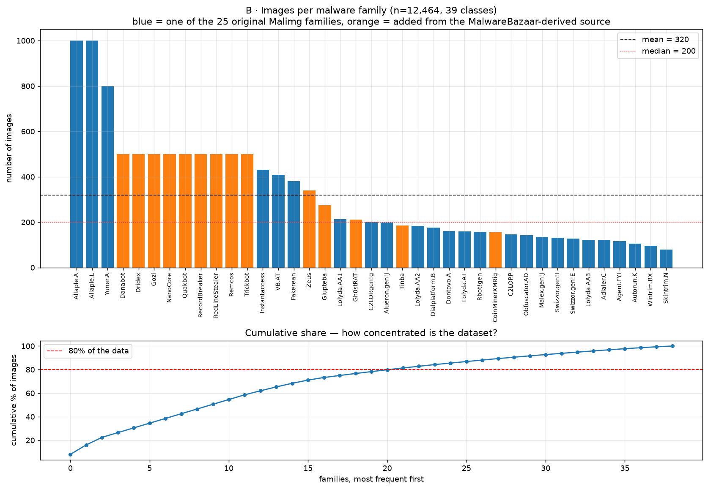

Majority class **Allaple.A** (**1,000** images, **8.02 %**); minority
**Skintrim.N** (**80** images, **0.64 %**); imbalance ratio **12.50 : 1**.
**22 of 39** families hold 80 % of the data.

A majority-class-only classifier would score accuracy **0.0802** but macro-F1
**0.0038** — a 21× gap between the two metrics on this label distribution.

**Consequence.** Accuracy is not a safe headline. Per brief §6.2 we report
**macro-F1 and per-class recall** as primary, select models on *validation
macro-F1*, and use inverse-frequency class weights in the loss.

## 3. What the images look like

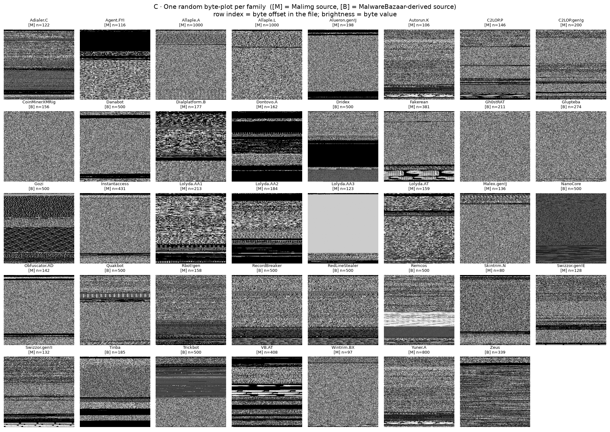

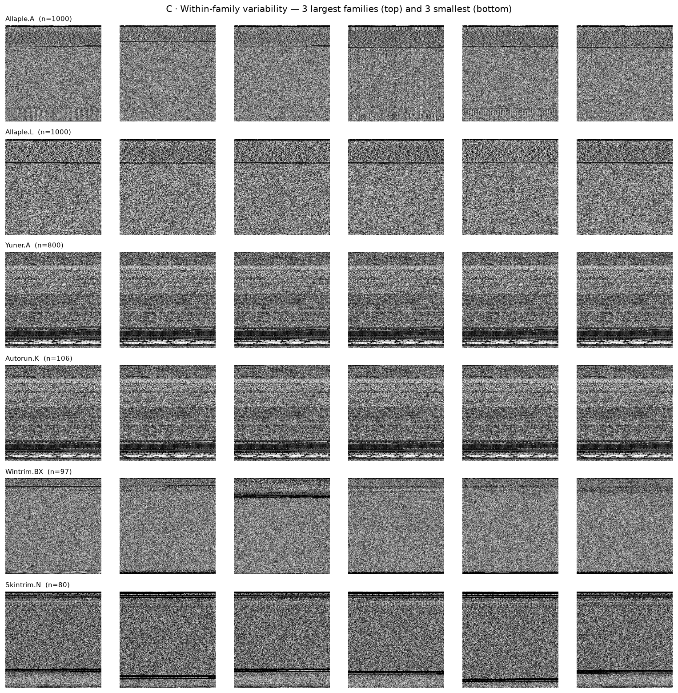

Two observations, both load-bearing:

1. **Byte-plots are horizontally banded, not object-like.** Each image is a stack
   of bands: dense speckle where executable code sits, strictly periodic patterns
   where a table or padding repeats, uniform black where the file is zero-padded,
   high-entropy noise where a section is packed or encrypted. *Vertical* position
   is meaningful (it is the byte offset); *horizontal* position is an artefact of
   the row width. → We choose **coordinate attention** in Task 2 and **forbid
   flips and rotations** in augmentation.
2. **Images within a family are often near-copies.** §4 quantifies this: the
   12,464 images collapse to **7,263 distinct binaries**, and three families
   (Yuner.A, Obfuscator.AD, Autorun.K) are each a *single* binary replicated
   106–800 times. That is a leakage hazard, measured in §4.3.

### File size as a weak signal

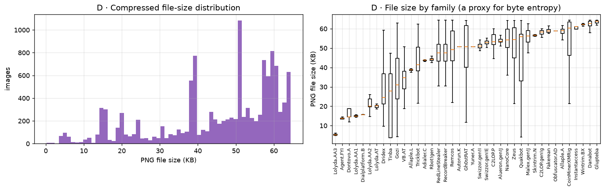

All images are 256×256, but compressed PNG size varies from **5.4 KB**
(Lolyda.AA3) to **62.1 KB** (Wintrim.BX) per family mean, because PNG compresses
low-entropy regions well. A packed or encrypted sample therefore stays large.
Notably **RecordBreaker and RedLineStealer have identical size statistics**
(mean 48.1 KB, std 9.7, min 11.6, median 47.6, max 64.3) — the first visible hint
of the defect confirmed in §4.4.

## 4. Data quality and the leakage risk — the decisive section

| Check | Result |
|---|---|
| Corrupt / unreadable | **0** |
| Constant images (std ≈ 0) | **0** |
| Near-constant (std < 3) | **0** |
| Exact pixel duplicates | **3,424** images in **670** groups |
| Duplicate hashes spanning >1 family | **498** (label noise — see §4.4) |
| Exact-duplicate union links | **2,754** |
| Near-duplicate links (dHash ≤ 6/128) | **453,054** |
| **Duplicate groups** | **7,263** for **12,464** images (**41.7 %** collapse) |
| Largest group | **800** images (all of Yuner.A) |
| Groups spanning >1 family | **435** (a dataset labelling defect — §4.4) |

### 4.1 The argument

Brief §6.2 requires a subject/source-based split. MaleBin ships no such column,
so we construct one. A malware family is a set of polymorphic variants of the
same program: two variants' byte-plots differ by a shifted section, a repacked
region or a few patched bytes, and are otherwise the same picture. MaleBin also
merges two partly-overlapping corpora, so one original sample can appear twice.
If a variant lands in train and its near-twin in test, the score measures
memorisation.

**Our grouping key.** SHA-1 of the pixel buffer (exact duplicates) ∪ 128-bit
difference hash with Hamming distance ≤ 6 searched within each family (near
duplicates), unioned with union-find. All splits and all CV folds in Tasks 2–3
are `StratifiedGroupKFold` on that key.

### 4.2 How much redundancy, and where

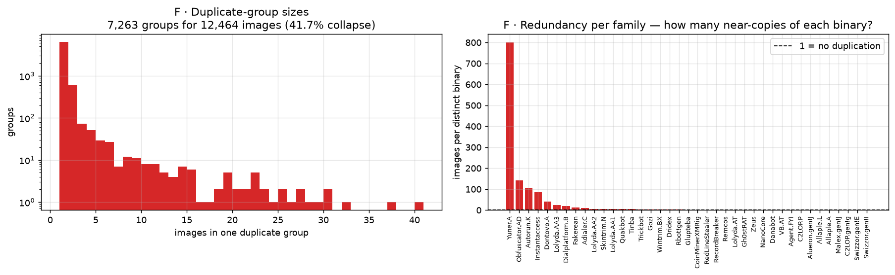

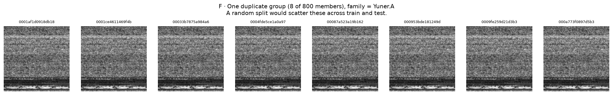

Redundancy is wildly uneven across families
(`artifacts/Group12_MaleBin_task1_F_redundancy_per_family.csv`):

| family | distinct binaries | images | images per binary |
|---|---|---|---|
| Yuner.A | 1 | 800 | **800.00** |
| Obfuscator.AD | 1 | 142 | **142.00** |
| Autorun.K | 1 | 106 | **106.00** |
| Instantaccess | 5 | 431 | 86.20 |
| Dontovo.A | 4 | 162 | 40.50 |
| Lolyda.AA3 | 5 | 123 | 24.60 |
| Dialplatform.B | 9 | 177 | 19.67 |
| … | … | … | … |
| Allaple.A | 999 | 1,000 | 1.00 |
| Swizzor.gen!I | 132 | 132 | 1.00 |

Three families are **one binary each**. Yuner.A contributes 800 images but
**one** distinct sample — under a random split, a model would train and test on
literally the same picture 800 times over.

### 4.3 Measured cost of getting the split wrong

A 1-nearest-neighbour classifier on the hand-made features, evaluated under both
protocols (`artifacts/Group12_MaleBin_task1_F_leakage_demo.csv`):

| Split protocol | Accuracy | Macro-F1 |
|---|---|---|
| Random (stratified) — **wrong** | **0.8025 ± 0.0039** | **0.8192 ± 0.0020** |
| Duplicate-grouped — **ours** | **0.6857 ± 0.0825** | **0.7041 ± 0.0204** |

**Inflation from splitting randomly: +0.1151 macro-F1 (+16.4 % relative.)**

A 1-NN on 20 hand-made descriptors is not a strong model. That it reaches
macro-F1 0.819 under a random split *is* the proof of memorisation — there is no
plausible reading in which such a model genuinely solves a 39-class problem at
that level. Note also the standard deviation: the grouped protocol's ±0.0825
accuracy spread is 21× the random protocol's ±0.0039, because grouped folds
differ in *which binaries* they hold out, whereas random folds are all drawn from
the same memorised pool.

**Consequence.** Our effective sample size is the number of **distinct binaries
(7,263)**, not the 12,464 image count. Our reported scores will be lower than the
published 99 %+ figures, and §7 explains why that is the honest number.

### 4.4 Two families are the same 500 images — a labelling defect

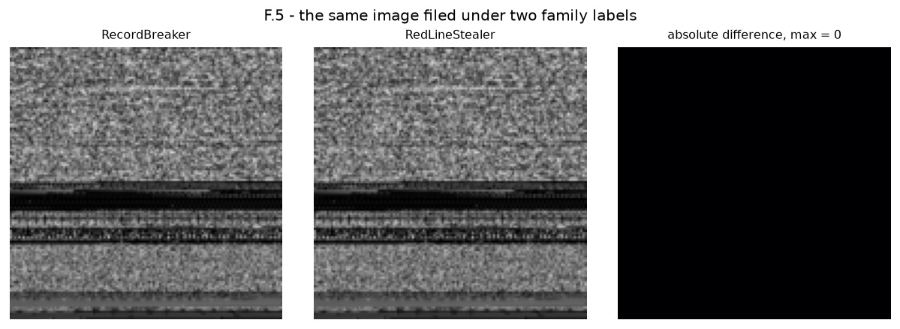

Near-duplicate search runs *within* a family, so the only way a duplicate group
can carry two family labels is an **exact pixel match filed under two folders**.
That happens here, at scale:

* **435 duplicate groups, covering 1,000 images**, carry more than one label.
* Every one of them is the same pair: **`RecordBreaker` + `RedLineStealer`**.
* Both families have 500 images; verified at native 256×256 resolution they have
  **499 unique hashes each and 499 shared** — they are byte-identical sets. The
  absolute-difference panel in the figure above is uniformly zero.

This is a defect in MaleBin v1, not in our pipeline, and the grouping is what
makes it harmless to the split: both copies are forced into one group, so no
image can train while its identical twin is tested.

**It does, however, impose a hard ceiling.** Two families that share their images
cannot both be recalled by any classifier. **2 of 39 families** are involved, so
roughly **0.026 of macro-F1 — one class' worth — is unreachable** no matter how
good the model is. Every macro-F1 we report in Tasks 2–3 should be read against a
practical maximum near **0.974**, not 1.000.

The original code asserted that no group may span two families and therefore
**aborted on the real dataset**. The assertion was wrong, not the grouping; it is
now a reported finding (`artifacts/Group12_MaleBin_task1_F_cross_family_groups.csv`).
See `report/REAL_RUN.md` §4.1.

### 4.5 A note on resolution

The duplicate analysis above is computed at 128×128. Tasks 2–3 re-derive the same
grouping from their own image cache (96×96 in this run) and obtain **7,261**
groups rather than 7,263 — a difference of 2 groups (0.03 %) that changes no
conclusion. The resulting hold-out split, used by every later notebook, is:

| subset | images |
|---|---|
| train | **8,698** |
| validation | **1,344** |
| test | **2,422** |
| **total** | **12,464** |

Grouped on duplicate-group id and stratified on family
(`artifacts/Group12_MaleBin_split_manifest.csv`).

## 5. Pixel and texture statistics

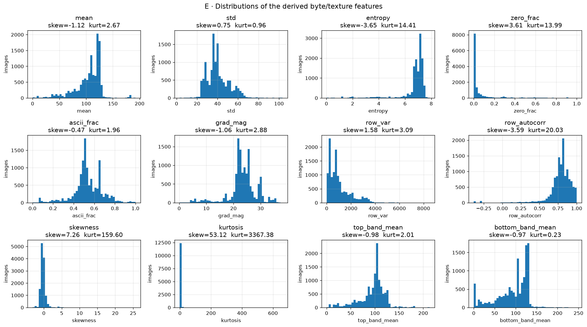

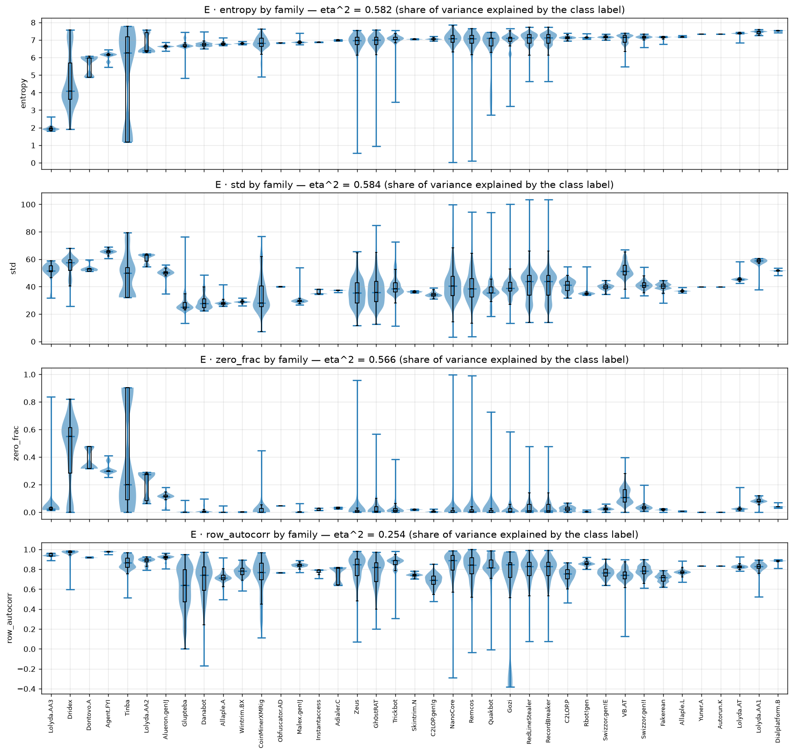

**21** interpretable descriptors per image (byte statistics + texture) computed
for all 12,464 images in 39.1 s: mean, median, std, min/max, quartiles, IQR,
skewness, kurtosis, Shannon byte entropy, zero-fraction, 0xFF-fraction,
printable-ASCII fraction, gradient magnitude, row/column variance, row
autocorrelation, and top/bottom band means. Full table:
`artifacts/Group12_MaleBin_task1_E_feature_stats.csv`; per-image values in
`artifacts/Group12_MaleBin_task1_E_image_features.csv`. **All values are finite**
— the notebook checks and reports this explicitly.

**Distributions are strongly non-Gaussian**, as expected from binaries with long
runs of `0x00` padding and `0xFF` filler:

| feature | mean | skewness | kurtosis |
|---|---|---|---|
| `high_frac` | 0.002 | **15.80** | **308.9** |
| `col_var` | 14.62 | **30.99** | **1236.9** |
| `kurtosis` | 0.846 | **53.12** | **3367.4** |
| `zero_frac` | 0.060 | 3.61 | 13.99 |
| `entropy` | 6.770 | −3.65 | 14.41 |

Mean byte entropy is **6.770 / 8.0**, confirming most samples are dense,
code-like or packed rather than sparse.

**Class-discriminative power (η², 0–1).** The draft of this report guessed that
entropy would lead; the measurement says otherwise:

| feature | η² |
|---|---|
| `q25` | **0.698** |
| `grad_mag` | **0.668** |
| `bottom_band_mean` | **0.631** |
| `row_var` | **0.604** |
| `mean` / `q50` / `median` | 0.601 |
| `std` | 0.584 |
| `entropy` | 0.582 |
| `top_band_mean` | 0.575 |
| … | … |
| `kurtosis` | 0.020 |
| `col_var` | **0.019** |

Two results matter here. First, **`row_var` (0.604) is 32× more discriminative
than `col_var` (0.019)** — direct quantitative evidence that *vertical* structure
carries family identity while horizontal structure does not. This is the
strongest single justification in the EDA for coordinate attention and for
banning vertical flips. Second, `bottom_band_mean` (0.631) beats
`top_band_mean` (0.575), i.e. the tail/padding region of a file is *more*
family-specific than the PE-header region.

No single scalar separates 39 classes — that is the job handed to the CNN — but
these η² values confirm the task is learnable from texture rather than noise.

## 6. Structure without a classifier: correlation, PCA, t-SNE, UMAP

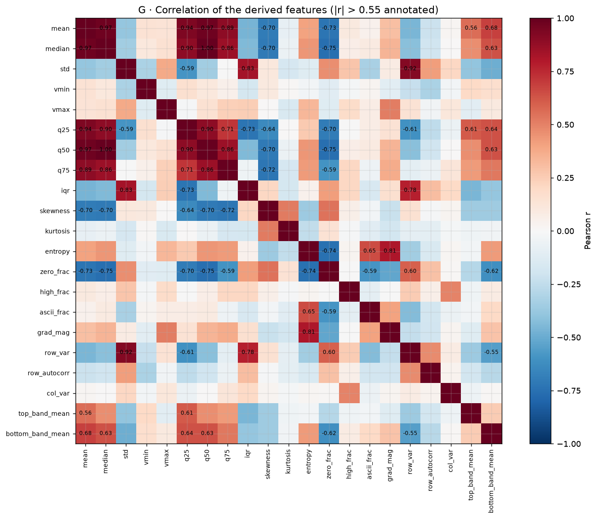

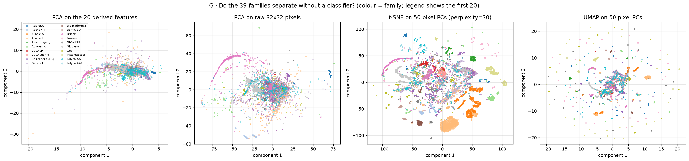

**Redundant feature pairs (|r| > 0.85) — 10 of them:**

| pair | r |
|---|---|
| `median` ~ `q50` | **+1.000** |
| `mean` ~ `median` | +0.969 |
| `mean` ~ `q50` | +0.969 |
| `mean` ~ `q25` | +0.936 |
| `std` ~ `row_var` | +0.915 |
| `median` ~ `q25` | +0.898 |
| `q25` ~ `q50` | +0.898 |
| `mean` ~ `q75` | +0.892 |
| `median` ~ `q75` | +0.858 |
| `q50` ~ `q75` | +0.858 |

`median` and `q50` are the same statistic by definition (r = +1.000 exactly),
which is a useful sanity check that the feature pipeline is correct.

**Variance structure.** PCA on the 21 derived features: first 2 PCs explain
**53.4 %**, first 10 → **94.2 %**. PCA on raw 32×32 pixels: first 2 explain
**58.2 %**, first 50 → **94.7 %**.

**Silhouette scores on the family labels (the important negative result):**

| projection | silhouette |
|---|---|
| PCA on the 21 derived features | **−0.114** |
| PCA on raw 32×32 pixels | **−0.084** |
| t-SNE on 50 pixel PCs (perplexity 30) | **−0.059** |
| UMAP on 50 pixel PCs | **−0.261** |

**All four are negative.** (+1 = perfectly separated, 0 = overlapping, −1 =
wrong clusters.) The families do **not** form separated islands in any of these
unsupervised 2-D views — the visible clusters correspond to *duplicate groups*,
not to family labels, which is precisely what §4 predicts when 41.7 % of the data
is redundant. UMAP is the most negative because it contracts those duplicate
lineages hardest.

**Reading.** No off-the-shelf projection of hand-made features or raw pixels
recovers the 39-class structure. That is the gap a learned representation has to
close, and it sets a realistic expectation for Task 2: this is not an easy,
already-separable problem once leakage is controlled. The specific families that
overlap are not identifiable from these projections and are deferred to the
**Task-2 confusion matrix**, with one exception already certain from §4.4 —
`RecordBreaker` and `RedLineStealer` are indistinguishable *by construction*.

Interactive versions: `figures/Group12_MaleBin_task1_H1_class_balance.html`,
`Group12_MaleBin_task1_H2_projection.html`,
`Group12_MaleBin_task1_H3_features.html`.

## 7. Related work and the research gap

See `related_work/Group00_MaleBin_related_work_table.md` for the full seven-paper
table (2023–2025) with the Track-3 *attention type* column; machine-readable copy
at `artifacts/Group12_MaleBin_task1_related_work_table.csv`.

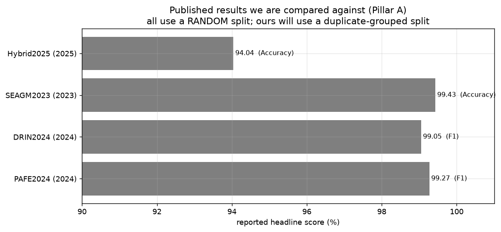

| Paper | Dataset | Attention | Headline | Comparable |
|---|---|---|---|---|
| Li et al. 2024 (PAFE) | Malimg 25 | SE inside multi-scale fusion | F1 99.27 | yes |
| Basak et al. 2024 (DRIN) | Custom 25-cls, Malimg, MaleVis | Involution | F1 99.05 | yes |
| Panda et al. 2023 (SE-AGM) | Malimg 25 | none (stacked ensemble) | Acc 99.43 | yes |
| Alshomrani et al. 2025 | Malimg+MaleVis+VirusMNIST, 61 cls | Swin self-attention | Acc 94.04 | yes |
| Zhang et al. 2024 (IMCMK-CNN) | Malimg + other image sets | improved SE | **not recorded**¹ | yes |
| Makkawy et al. 2025 (MalVis) | MalVis >1.3 M, 9 cls + benign | none | macro-F1 90.81 | no |
| Jayasudha et al. 2023 | Malimg, blended, MaleVis | none | Precision ≤ 97 | no |

¹ IMCMK-CNN's headline value is absent from our extraction table and the paper
PDF is not in `related_work/papers/`, so we do not quote a figure for it. Its
*attention type* — improved channel-only SE — is what matters for our argument
and is recorded.

**The gap.** All seven share three properties:

1. **Every number comes from a random split.** None controls for polymorphic
   near-duplicates or for provenance overlap between merged corpora. §4.3
   measured what that is worth on this data: **+0.1151 macro-F1** for a model
   that is not even trying.
2. **The headline metric is accuracy or precision** on imbalanced data. Only
   MalVis reports macro-F1, and there it sits 4.4 points *below* accuracy
   (90.81 vs 95.19). The byte-plot papers never publish that gap; Basak et al.
   explicitly admit their model "struggles with underrepresented classes".
3. **Attention, where used, discards position** — SE and involution global-pool,
   Swin treats position as a generic 2-D coordinate at much higher cost. Nobody
   exploits the fact that **the row index is the byte offset in the file** —
   despite our η² measurement showing row variance is 32× more class-informative
   than column variance.

**What we will do.** A small from-scratch CNN with *direction-aware* attention
(coordinate attention: a per-row and a per-column gate) on top of multi-scale
dilated convolutions, byte-aware augmentation that never flips or rotates, a
**duplicate-grouped** split, and **macro-F1** as the headline — reported on both
the Malimg-25 subset (strictly fair comparison) and full MaleBin-39.

## 8. Dataset limitations we inherit

The uploader states three things that cap what any model can achieve here, and we
carry them into Tasks 2 and 3 rather than hiding them:

1. The **Malimg half is outdated malware** — reliable in a closed set, not
   generalisable to modern threats. It is **6,799 of 12,464 images (54.6 %)**.
2. **Resizing distorts the images**: all samples were forced to 256×256, so
   65,536 pixels stand in for files of very different true lengths. Any
   byte-offset reading is approximate.
3. A newer **MaleBin 2.0 RGB** dataset exists and the uploader recommends it over
   v1; we use v1 because it is the version on the course dataset list.

To these we add a fourth, found by this EDA and not disclosed by the uploader:

4. **`RecordBreaker` and `RedLineStealer` are the same 500 images under two
   labels** (§4.4), capping achievable macro-F1 at roughly 0.974.

## 9. Task 1 conclusions → Task 2 decisions

| Finding (measured) | Decision |
|---|---|
| Uniform 256×256×1, **0** corrupt files | Input is `1×H×W` after one resize; no colour pipeline |
| Imbalance **12.50 : 1**; majority-only baseline = 0.0802 acc / 0.0038 macro-F1 | macro-F1 headline; inverse-frequency class weights; select on val macro-F1 |
| No subject column; **41.7 %** duplicate collapse, **7,263** distinct binaries | Duplicate-grouped stratified splits and CV folds; effective *n* = 7,263 |
| Random split inflates macro-F1 by **+0.1151** | Grouped split is mandatory; we report the lower, honest number |
| `row_var` η² **0.604** vs `col_var` η² **0.019** (32×) | **Coordinate attention**; **no** flips or rotations |
| Signal at byte / block / section scale; `grad_mag` η² 0.668 | **Multi-scale dilated** conv block |
| All silhouettes **negative** (−0.059 to −0.261) | Do not expect an easy problem; judge on per-class recall, not averages |
| **435** cross-family duplicate groups (RecordBreaker ≡ RedLineStealer) | Macro-F1 ceiling ≈ 0.974; exclude this pair from any "model failed" reading |
| All related work: random split + accuracy headline | Our numbers will be lower; the fair comparison is the Malimg-25 scope |
