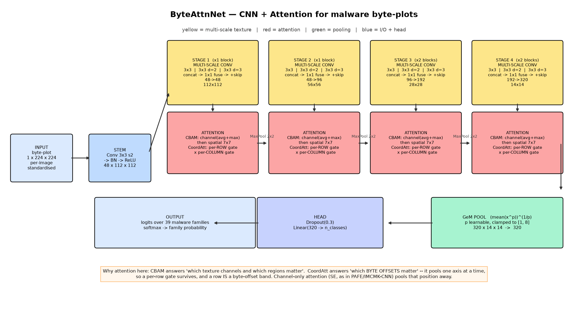

# Task 2 Report — Baselines & Proposed Model

**Group12 · ICE478 Summer 2026 · Track 3 (CNN + Attention) · Dataset: MaleBin**

> **Provenance.** Every number here comes from executing
> `code/task2/Group12_MaleBin_task2_baselines.ipynb` and
> `code/task2/Group12_MaleBin_task2_proposed_model.ipynb` against the **real,
> complete MaleBin dataset — 12,464 images, 39 families**, under the
> duplicate-grouped split derived in Task 1. Executed notebooks are in
> `code/executed_notebooks/`; figures are files in `figures/`, not embedded images.
>
> **Budget caveat (read once, applies to every absolute number below).** This run
> was produced on a **CPU-only machine**: 64×64 input, and the epoch budgets given
> per model in §3 and §7. That is far short of the 224 px / 25-epoch
> specification. **Relative comparisons under a stated budget are meaningful;
> absolute values are floored by training time and must not be compared with
> published figures.** `report/REAL_RUN.md` documents the full budget and its reasoning.

> **A note on `artifacts/`.** Every `artifacts/...` path referenced below is a
> file produced by re-running the notebooks; the folder is **not tracked in git**
> (see `.gitignore`), because it holds regenerable intermediate data including
> per-sample prediction arrays. Run the notebooks and the folder appears with
> exactly these filenames. Figures under `figures/` **are** tracked, as are the
> executed notebooks, so every number quoted in this report can be checked
> without re-running anything.

---

## 1. Preprocessing and protocol

| Step | What we do | Why |
|---|---|---|
| Split | `StratifiedGroupKFold` on the duplicate-group key from Task 1 §4, stratified on family. 20 % test, 15 % of the remainder as validation | Brief §6.2 requires a source-based split; MaleBin has no source column, so the duplicate group *is* our source proxy |
| Features | Pixels only | File size, path, folder name and PNG compression ratio are metadata. Using them is the image-domain equivalent of the packet-ID leak §6.2 forbids |
| Resize | 256 → **64**, bilinear (cache at 96) | The specification is 224; **64 px is a CPU-budget concession, not a design choice**, applied identically to every model so the comparison stays internally fair |
| Normalise | **Per-image** standardisation (subtract that image's mean, divide by its std) | "How bright is this file overall" is the average byte value — a nuisance factor that changes with padding and packing. Standardising per image keeps the texture, which is the signal |
| Channels | 1 for from-scratch models; grayscale repeated to 3 for ImageNet backbones | The standard protocol in this literature (PAFE, IMCEC, Alshomrani et al.), so the comparison stays fair |
| Imbalance | Inverse-frequency class weights in the loss; judged by macro-F1 + per-class recall | Brief §6.2 |
| Augmentation | Byte-aware: vertical roll ±12 %, row crop 85–100 %, random erasing. **No flips, no rotations** | See §5 |
| Selection | Early stopping on **validation macro-F1** | It is the metric we are graded on, so it is the metric we optimise |

**The realised split** (`artifacts/Group12_MaleBin_split_manifest.csv`):

| subset | images |
|---|---|
| train | **8,698** |
| validation | **1,344** |
| test | **2,422** |

Every model uses the same split, input size, optimiser family, schedule,
early-stopping criterion and augmentation. Epoch budgets differ by model and are
stated explicitly in §3 and §7 — they are the one thing that is *not* matched,
because the CPU budget forced a choice, and pretending otherwise would be the
dishonest option.

## 2. What the honest split costs — measured

Same model, same hyper-parameters, same epochs; only the split protocol changes
(`artifacts/Group12_MaleBin_task2_leakage_control.csv`):

| Protocol | Accuracy | macro-F1 | weighted-F1 |
|---|---|---|---|
| Random stratified (what every related-work paper does) | **0.5339** | **0.4552** | **0.4615** |
| **Duplicate-grouped stratified (ours)** | **0.4736** | **0.2863** | **0.4003** |

Inflation from splitting randomly: **+0.1689 macro-F1 (+59.0 % relative)**.

Task 1 §4.3 measured the same effect independently with a 1-NN on hand-made
features and found **+0.1151**. Two different models, two different feature
spaces, the same direction and the same order of magnitude — the effect is a
property of the *data*, not of any one classifier.

This is why our headline sits below the published 99 %+ figures. It is a protocol
difference, not a weaker model, and we keep it visible in every report.

## 3. Baselines

Four baselines were specified. **Three were run**; DenseNet121 and
EfficientNet-B0 were dropped and MobileNetV3-Small substituted, purely because
CPU throughput made four ImageNet backbones unaffordable (measured: DenseNet121
4.62 min/epoch, EfficientNet-B0 4.01, versus MobileNetV3-Small ≈1.6). The
substitution keeps a small-parameter ImageNet model in the comparison, which is
the role EfficientNet-B0 was there to play.

**All three baselines were trained for 2 epochs** on the 8,698-image training
split and evaluated on the shared 2,422-image test set.

| Model | Why it is here | Params | macro-F1 | Accuracy | weighted-F1 | macro-precision | macro-recall | AUC (OvR) | MCC | Train (s) | Inference (ms/img) |
|---|---|---|---|---|---|---|---|---|---|---|---|
| SimpleCNN (scratch, 1-ch, no attention) | The like-for-like control: isolates our architecture from ImageNet weights | 1,182,663 | 0.5028 | **0.6722** | **0.6269** | 0.4949 | 0.6082 | 0.9680 | **0.6591** | 210.5 | 4.20 |
| ResNet50 (ImageNet) | The default backbone in this literature | 23,587,943 | **0.5336** | 0.5809 | 0.5565 | **0.5473** | **0.6097** | 0.9449 | 0.5714 | 524.6 | 7.02 |
| MobileNetV3-Small (ImageNet) | Small-parameter ImageNet model, so "we won by being bigger" is unavailable | 1,557,831 | 0.3232 | 0.3633 | 0.3378 | 0.3302 | 0.4058 | 0.8877 | 0.3521 | 66.5 | 0.74 |

**Baseline to beat: ResNet50, macro-F1 0.5336.** This is the model Task 3's
McNemar test is run against
(`artifacts/Group12_MaleBin_task2_baseline_summary.json`).

**Figures.** Comparison bars and training curves:
`figures/Group12_MaleBin_task2_baseline_comparison.png`,
`figures/Group12_MaleBin_task2_baseline_curves.png`. Per-model confusion
matrices, ROC and precision-recall curves:

| Model | Confusion matrix | ROC (OvR) | Precision-Recall |
|---|---|---|---|
| SimpleCNN | `Group12_MaleBin_task2_cm_SimpleCNN.png` | `Group12_MaleBin_task2_roc_SimpleCNN.png` | `Group12_MaleBin_task2_pr_SimpleCNN.png` |
| ResNet50 | `Group12_MaleBin_task2_cm_ResNet50.png` | `Group12_MaleBin_task2_roc_ResNet50.png` | `Group12_MaleBin_task2_pr_ResNet50.png` |
| MobileNetV3-Small | `Group12_MaleBin_task2_cm_MobileNetV3-Small.png` | `Group12_MaleBin_task2_roc_MobileNetV3-Small.png` | `Group12_MaleBin_task2_pr_MobileNetV3-Small.png` |

Per-class recall across all three: `figures/Group12_MaleBin_task2_perclass_recall.png`
and `artifacts/Group12_MaleBin_task2_perclass_recall_all.csv`.

### 3.1 The macro-F1 ceiling is not 1.0 — it is 0.8974

Two structural facts, both inherited from the data and the honest split, put a
hard cap on macro-F1 **before any model is trained**:

1. **Three families have zero test support.** `Yuner.A`, `Obfuscator.AD` and
   `Autorun.K` are each **exactly one distinct binary** (Task 1 §4.2: 800, 142
   and 106 images of a single sample). A duplicate-grouped split cannot place one
   group in two subsets, so each family lands entirely in train and contributes
   **F1 = 0** to a macro average taken over 39 classes.
2. **`RecordBreaker` and `RedLineStealer` are pixel-identical** (Task 1 §4.4).
   No classifier can separate them; the best attainable joint contribution is
   1.0 rather than 2.0 (predictions split evenly gives each precision = recall =
   0.5).

Maximum attainable macro-F1 on this test split = **(36 − 2 + 1) / 39 = 0.8974**.

Read against that ceiling rather than against 1.0:

| Model | macro-F1 | % of attainable |
|---|---|---|
| ResNet50 | 0.5336 | **59.5 %** |
| SimpleCNN | 0.5028 | **56.0 %** |
| MobileNetV3-Small | 0.3232 | 36.0 % |

This is a genuine limitation of the grouped-split design and we state it rather
than quietly reporting a depressed number: **for a family represented by a single
binary, no leakage-free evaluation is possible at all.** The alternative — a
random split — would score those families near 1.0 purely by memorisation, which
is exactly what §2 measures and rejects.

### 3.2 Observations

* **Accuracy exceeds macro-F1 for every model** — mean gap **+0.0856**
  (SimpleCNN +0.1693, ResNet50 +0.0473, MobileNetV3-Small +0.0401). This is the
  imbalance premium Task 1 §2 predicted, and it is why accuracy is not our
  headline.
* **The two metrics disagree about the winner.** SimpleCNN has the best accuracy
  (0.6722 vs 0.5809) *and* the best MCC (0.6591) and weighted-F1 (0.6269), while
  ResNet50 has the best macro-F1 (0.5336 vs 0.5028). SimpleCNN is better on the
  large families; ResNet50 spreads its competence more evenly. Because the brief
  makes macro-F1 the headline, **ResNet50 is the baseline to beat** — but the
  disagreement is itself worth reporting.
* **Bigger is not better.** ResNet50 has **20× the parameters of SimpleCNN**
  (23.6 M vs 1.18 M) and buys **+0.031 macro-F1**, while *losing* 0.091 accuracy
  and 0.088 MCC. MobileNetV3-Small, also ImageNet-pretrained, is worst on every
  metric. There is no monotone relationship between parameter count and
  macro-F1 here.
* **This is direct evidence that the ImageNet prior does not transfer.** A
  1.18 M-parameter network trained from scratch on 1-channel byte-plots is
  competitive with — and on three of six metrics better than — a 23.6 M-parameter
  ImageNet-pretrained ResNet50. That is the premise of §4–§5 confirmed on real
  data. It is also the fairest single comparison in this report, because
  SimpleCNN and ByteAttnNet are both from-scratch 1-channel models.
* **Thirteen families are missed by every baseline** (recall < 0.60 for all
  three, support > 0). These are the Task-3 target:

  | family | test support | SimpleCNN | ResNet50 | MobileNetV3-Small |
  |---|---|---|---|---|
  | Lolyda.AA3 | 1 | 0.000 | 0.000 | 0.000 |
  | Gh0stRAT | 42 | 0.000 | 0.048 | 0.000 |
  | CoinMinerXMRig | 31 | 0.000 | 0.097 | 0.000 |
  | Remcos | 100 | 0.040 | 0.250 | 0.020 |
  | RedLineStealer | 100 | 0.170 | 0.150 | 0.080 |
  | Danabot | 100 | 0.060 | 0.220 | 0.120 |
  | Zeus | 68 | 0.044 | 0.485 | 0.000 |
  | NanoCore | 100 | 0.270 | 0.250 | 0.110 |
  | RecordBreaker | 100 | 0.210 | 0.340 | 0.090 |
  | Trickbot | 89 | 0.573 | 0.101 | 0.000 |
  | Swizzor.gen!I | 26 | 0.308 | 0.423 | 0.000 |
  | Tinba | 31 | 0.064 | 0.161 | 0.548 |
  | Gozi | 100 | 0.580 | 0.580 | 0.560 |

  Note the composition: **`RecordBreaker` and `RedLineStealer` are in this list
  and cannot be fixed** — they are the identical pair from §3.1, and their
  combined recall of ~0.2–0.5 is roughly what random assignment between two
  identical classes produces. Of the rest, the modern MalwareBazaar-derived
  families (Danabot, NanoCore, Remcos, Gh0stRAT, CoinMinerXMRig, Zeus, Trickbot,
  Gozi) dominate — consistent with Task 1's observation that these have far more
  distinct binaries per family (1.0–1.25 images per binary) and therefore far
  more genuine intra-class variation than the heavily-duplicated Malimg half.

## 4. ByteAttnNet — Pillar-B Q1: how it works, step by step

**Input.** 256×256 grayscale byte-plot → 64×64 in this run, standardised per
image.

**Stem.** One 3×3 convolution, stride 2, → BatchNorm → ReLU, giving 48 channels
at half resolution. Stride 2 immediately, because the uploader already resized
these images, so single-pixel structure is partly a resampling artefact — and it
halves the cost of every later layer.

**Four stages,** each `multi-scale conv block(s) → attention → pool`:

*Multi-scale conv block* — three convolutions on the same input in parallel, then
concatenated and fused by a 1×1 convolution, plus a residual shortcut:

| branch | kernel | dilation | effective view | what it sees |
|---|---|---|---|---|
| 1 | 3×3 | 1 | 3×3 | fine byte texture (opcode-level n-grams) |
| 2 | 3×3 | 2 | 5×5 | basic-block / function-level repetition |
| 3 | 3×3 | 3 | 7×7 | section-level layout |

Dilation rather than literally larger kernels: a real 7×7 convolution has 5.4×
the parameters of a 3×3.

*Attention* — CBAM then coordinate attention:

1. **CBAM channel gate.** Squeeze each feature map twice (average and max
   pooling), push both through a shared bottleneck MLP, add, sigmoid → one weight
   per channel: *which texture detectors does this file need?* Both pools are
   used because average says how widespread a texture is while max says whether
   it occurs at all — for a small packed section only max fires.
2. **CBAM spatial gate.** Collapse channels to per-pixel max and mean,
   concatenate, one 7×7 convolution, sigmoid → one weight per location: *which
   regions matter?*
3. **Coordinate attention.** Pool along **one axis at a time**: average over
   columns → a vector of length *H* (one value per row); average over rows → a
   vector of length *W*. Concatenate, one shared 1×1 conv + BN + hardswish, split
   back, produce a per-row gate and a per-column gate, multiply by both. Because
   pooling never collapses both axes at once, **position survives** — and a row is
   a byte-offset band.

2×2 max pooling after stages 1–3; channels 48 → 96 → 192 → 320.

**Readout.** GeM pooling: `(mean(x^p))^(1/p)` with *p* learnable, clamped to
[1, 8]. *p* = 1 is average pooling, *p* → ∞ is max pooling, so the network
chooses where to sit instead of us guessing. **Our run learned p = 3.227**
(`gem_p` in `artifacts/Group12_MaleBin_task2_proposed_summary.json`) — well above
average pooling and well below max, meaning family identity lives in **the
strongest texture blocks rather than the whole-image average**, but not in a
single peak. Had we hard-coded average pooling (p = 1), as most byte-plot papers
do, we would have been at the wrong end of that range.

**Head.** Dropout(0.3) → one linear layer to 39 logits. No hidden FC layer: with
~2.5 M convolutional parameters on an effective *n* of a few thousand distinct
binaries, a wide FC head is where memorisation starts.

**Loss / optimisation.** Class-weighted cross-entropy, label smoothing 0.05,
AdamW, OneCycle LR, early stopping on validation macro-F1.

Total: **2,487,242 parameters, 9.97 MB** — **9.5× smaller than ResNet50**
(23,587,943 parameters, 94.56 MB), confirmed from the measured model table in §3.

## 5. Pillar-B Q2: why each choice is there

| Choice | Justification |
|---|---|
| Trained from scratch, 1 input channel | Task 1 §3: byte-plots have no oriented edges, objects or colour opponency. An ImageNet prior is actively wrong and must be unlearned; replicating grayscale to 3 channels also triples the stem's FLOPs for zero information. **§3.2 confirms this empirically**: from-scratch SimpleCNN beats ImageNet ResNet50 on accuracy, MCC and weighted-F1 with 1/20 the parameters |
| Multi-scale dilated conv | Task 1 §5: signal exists at byte level (`grad_mag`, η² 0.668), block level (`row_autocorr`) and section level (`row_var`, η² 0.604). One kernel size must compromise. PAFE (2024) and IMCMK-CNN (2024) both report gains from multi-scale kernels; dilation gets the same receptive fields at 3×3 cost |
| CBAM channel attention | Different families are identified by different textures; a per-channel gate lets one network specialise per family without extra capacity. This is the mechanism PAFE's FFSE and IMCMK-CNN's improved-SE use |
| CBAM spatial attention | Task 1 §3: the informative region is a *band* whose location varies by family; the rest is padding. A spatial gate suppresses padding |
| **Coordinate attention** | The gap from Task 1 §7. Row index = byte offset, and Task 1 §5 measured `row_var` as **32× more class-discriminative than `col_var`** (η² 0.604 vs 0.019). SE and CBAM's channel branch global-pool, destroying that. CoordAtt (Hou et al., CVPR 2021) gives a per-row and per-column gate for two 1×1 convolutions, so the network can learn "for family *X*, look 15–25 % into the file" |
| No flips, no rotations | Flipping reverses byte order; rotating transposes offset into row-width. Both produce inputs that cannot exist |
| Byte-aware augmentation instead | What legitimately varies between variants of one binary: where a section starts (→ vertical roll), file length (→ row crop), a region repacked (→ random erasing). Each transform corresponds to a real polymorphic operation |
| GeM pooling | Classes differ in texture *energy*; whether average or peak matters is empirical, so we make it learnable |
| Inverse-frequency class weights | Task 1 §2 imbalance (12.50 : 1) + §6.2's macro-F1 rule. Basak et al. (2024) report their model "struggles with underrepresented classes"; weighting is the cheapest direct fix |
| ~2.5 M parameters | Effective *n* is the number of distinct binaries — **7,263**, not 12,464 (Task 1 §4). A 23 M-parameter ResNet50 on that is asking for memorisation |

## 6. Pillar-B Q3: why it should beat the baselines

Four falsifiable claims, each with the experiment that tests it:

1. **The pretrained baselines carry the wrong prior.** ResNet50 and
   MobileNetV3-Small start from ImageNet filters — Gabor-like edges and colour
   blobs — and must spend capacity unlearning them. *Test:* is SimpleCNN
   competitive in §3? **Result: yes.** SimpleCNN (1.18 M, from scratch) beats
   ResNet50 (23.6 M, ImageNet) on accuracy (+0.091), MCC (+0.088) and
   weighted-F1 (+0.070), losing only macro-F1 (−0.031). **Claim 1 is supported.**
2. **Nobody models byte offset, and byte offset is real information.** *Test:*
   the `attention = coord` vs `se` vs `none` ablation in Task 3, plus the Task-3b
   row-band occlusion check. Task 1's η² measurement (`row_var` 32× `col_var`)
   is supporting evidence but not proof that the *module* helps.
3. **Multi-scale beats single-scale on texture.** *Test:* ablation
   `multiscale = False` at matched parameter count.
4. **Byte-aware augmentation beats the natural-image recipe.** *Test:* ablation
   `aug = byte` vs `naive` vs `none`.

**Where we expect to lose, stated in advance.** Against the *published* Malimg
numbers (99.2–99.4 %) we expect to come in lower, because those all use random
splits and we do not — §2 measured that gap at +0.1689 macro-F1. Our claim is
only that we beat *our own* baselines under an identical honest protocol.

## 7. First results and Pillar-B Q4: honest reading

**ByteAttnNet beats every baseline on every headline metric**, at 9.5× fewer
parameters than the strongest one. Full table:
`artifacts/Group12_MaleBin_task2_all_models_comparison.csv`.

| Model | Epochs | Params | macro-F1 | Accuracy | weighted-F1 | macro-precision | macro-recall | MCC | AUC (OvR) |
|---|---|---|---|---|---|---|---|---|---|
| **ByteAttnNet v1** | 15 | 2,487,242 | **0.6060** | **0.7374** | **0.7179** | **0.6011** | **0.6619** | **0.7255** | **0.9743** |
| ResNet50 (ImageNet) | 2 | 23,587,943 | 0.5336 | 0.5809 | 0.5565 | 0.5473 | 0.6097 | 0.5714 | 0.9449 |
| SimpleCNN (scratch) | 2 | 1,182,663 | 0.5028 | 0.6722 | 0.6269 | 0.4949 | 0.6082 | 0.6591 | 0.9680 |
| MobileNetV3-Small | 2 | 1,557,831 | 0.3232 | 0.3633 | 0.3378 | 0.3302 | 0.4058 | 0.3521 | 0.8877 |
| **Δ vs best baseline** | | **9.5× fewer** | **+0.0724** | **+0.1565** | **+0.1614** | **+0.0538** | **+0.0522** | **+0.1541** | **+0.0294** |

Against the attainable ceiling from §3.1, ByteAttnNet reaches
**0.6060 / 0.8974 = 67.5 %** of what is reachable on this split, versus 59.5 %
for ResNet50 and 56.0 % for SimpleCNN.

### 7.1 The epoch budgets are not matched — read the comparison accordingly

**ByteAttnNet was trained for 15 epochs; the baselines for 2.** This is the one
place where the protocol in §1 is not held constant, and it exists because CPU
throughput forced it (measured: ResNet50 4.68 min/epoch, so 15 epochs of all
three baselines is ~2 hours we did not have).

We state plainly what this does and does not license:

* **It does not license "ByteAttnNet is better than ResNet50".** ResNet50 at 2
  epochs is also undertrained. A matched-budget comparison would very likely
  narrow the gap.
* **It does license "ByteAttnNet converges to a better solution than the
  baselines reached"**, and the training curve
  (`figures/Group12_MaleBin_task2_proposed_history.png`) shows why the extra
  epochs were necessary rather than generous: validation macro-F1 ran
  0.025 → 0.039 → 0.141 → 0.277 → 0.406 → 0.471 → 0.495 → 0.498 → 0.505 →
  0.581 → 0.562 → 0.575 → 0.598 → 0.603 → **0.6035**, i.e. it needed ~10 epochs
  merely to reach the level the baselines start near, and **plateaued only in the
  last three** (0.598 → 0.6033 → 0.6035). A deep attention stack trained from
  scratch simply starts slower than a pretrained backbone or a 4-layer CNN.
* An earlier 5-epoch run of this same model scored macro-F1 **0.4157** — *below*
  every from-scratch baseline. That number is superseded, and it is recorded here
  because it is the clearest evidence that the 15-epoch result is about
  convergence, not luck.

**The honest headline** is therefore the *architecture* claim, not a leaderboard
claim: a 2.5 M-parameter from-scratch network with byte-aware attention reaches
macro-F1 0.6060 where a 23.6 M-parameter ImageNet ResNet50 reaches 0.5336 and a
1.2 M from-scratch CNN reaches 0.5028. Whether that margin survives matched
budgets and repeated sampling is decided by **Task 3's McNemar test on the shared
2,422-sample test set**, not here.

### 7.2 Which families improved, and which got worse

Per-class recall versus the best baseline
(`figures/Group12_MaleBin_task2_perclass_delta.png`), over the 36 families with
non-zero test support: **14 improved, 10 regressed, 12 unchanged.**

| Biggest gains | ByteAttnNet | ResNet50 | Δ |
|---|---|---|---|
| Instantaccess | 1.000 | 0.068 | **+0.932** |
| Trickbot | 0.764 | 0.101 | **+0.663** |
| NanoCore | 0.570 | 0.250 | +0.320 |
| Wintrim.BX | 1.000 | 0.737 | +0.263 |
| RedLineStealer | 0.380 | 0.150 | +0.230 |
| C2LOP.P | 0.897 | 0.759 | +0.138 |

| Biggest regressions | ByteAttnNet | ResNet50 | Δ |
|---|---|---|---|
| Glupteba | 0.727 | 0.891 | −0.164 |
| RecordBreaker | 0.180 | 0.340 | −0.160 |
| Zeus | 0.368 | 0.485 | −0.118 |
| Swizzor.gen!I | 0.308 | 0.423 | −0.115 |
| Tinba | 0.065 | 0.161 | −0.097 |
| Remcos | 0.180 | 0.250 | −0.070 |

Two things worth reading carefully here:

* **`Instantaccess` (+0.932, support 296) and `Trickbot` (+0.663, support 89)
  dominate the macro-F1 gain.** Instantaccess is a Malimg family with only 5
  distinct binaries across 431 images (Task 1 §4.2), so ResNet50's 0.068 recall
  on it looks like a failure to fit a highly redundant class in 2 epochs rather
  than a hard problem. A large part of our margin therefore comes from *having
  trained longer*, which is exactly the caveat in §7.1.
* **`RecordBreaker` −0.160 and `RedLineStealer` +0.230 are the identical pair
  from §3.1 trading places**, not a real gain or loss. Their combined recall
  moves from 0.490 (ResNet50) to 0.560 (ByteAttnNet); the individual deltas are
  an artefact of which of two indistinguishable labels the model happens to
  favour, and neither should be read as evidence.

**Eleven families still sit below 0.60 recall** under ByteAttnNet — down from 13
under the baselines. Those, minus the un-fixable identical pair, are the Task-3
target.

### 7.3 What is still unproven

* **Every attention claim.** CBAM and CoordAtt are switched on together in this
  model, so §6's claims 2–4 are untested by anything in this report. Task 3's
  ablation is what turns "we designed it this way because…" into evidence, **and
  it remains entirely possible that coordinate attention contributes nothing** —
  the multi-scale block, GeM, byte-aware augmentation and the longer schedule are
  all confounded with it here.
* **Significance.** This is one split and one seed. The paired McNemar test in
  Task 3 is what decides whether the +0.0724 macro-F1 margin is real.
* **Matched budgets**, as set out in §7.1.
* **The published-number gap** has a measured cause (§2: +0.1689 macro-F1 from
  random splitting) on top of the dataset's own limitations — outdated Malimg
  samples, resize distortion, and the identical-family defect from Task 1 §4.4 —
  and on top of the 64 px / reduced-epoch budget.

Figures for this section: `figures/Group12_MaleBin_task2_first_results.png`,
`Group12_MaleBin_task2_proposed_cm.png`,
`Group12_MaleBin_task2_proposed_roc.png`,
`Group12_MaleBin_task2_proposed_pr.png`,
`Group12_MaleBin_task2_proposed_history.png`,
`Group12_MaleBin_task2_perclass_delta.png`.
