# Task 3 Report (Final) — Improvement, Comparison & Explainability

**Group12 · ICE478 Summer 2026 · Track 3 (CNN + Attention) · Dataset: MaleBin**

---

## 1. Summary

We classify 39 malware families from 256×256 grayscale byte-plots with
**ByteAttnNet**, a 2.4 M-parameter from-scratch CNN built on multi-scale dilated
convolutions. Everything is evaluated under a **duplicate-grouped,
family-stratified** split, because MaleBin's polymorphic near-duplicates make a
random split measure memorisation (Task 1 §4.3: +0.1151 macro-F1 of pure
inflation).

**The headline finding is a negative one, and it is the most important result in
this report: the attention stack — the novel part of the design — does not earn
its place. Removing attention entirely produced the best model.**

| | Result |
|---|---|
| Final macro-F1 (held-out test) | **0.6465** |
| Final accuracy | **0.7647** |
| Final weighted-F1 | **0.7537** |
| Final MCC / Cohen's κ | **0.7538** / **0.7527** |
| Final ROC-AUC (macro OvR) | **0.9813** |
| Best baseline (ResNet50) macro-F1 | 0.5336 |
| Improvement over best baseline | **+0.1128 macro-F1** |
| McNemar vs ResNet50 | χ² = **324.77**, *p* = **1.3 × 10⁻⁷²** → **SIGNIFICANT** |
| McNemar vs SimpleCNN | χ² = **158.37**, *p* = **2.6 × 10⁻³⁶** → **SIGNIFICANT** |
| McNemar vs MobileNetV3-Small | χ² = **889.47**, *p* = **1.9 × 10⁻¹⁹⁵** → **SIGNIFICANT** |
| Cross-validation / Wilcoxon / Friedman | **not run** (§4) |
| Pillar-A verdict, scope `malebin39` | **BELOW** (−17.57 points, indicative only) |
| Parameters vs best baseline | **9.8× fewer** (2,417,392 vs 23,587,943) |
| Macro-F1 as a fraction of the attainable ceiling (Task 2 §3.1) | **72.0 %** of 0.8974 |

## 2. Ablation study — what each design decision is actually worth

Protocol: one variable changed at a time; same split, seed, epoch budget and
early-stopping criterion for every run; each variant evaluated at **its own best
validation checkpoint**; ranking read from **held-out test macro-F1**, not from
the value we early-stopped on.

### 2.1 Attention — the central claim, and it does not survive

Six variants of exactly the same network, differing only in the attention module.
12 epochs each (`artifacts/Group12_MaleBin_task3_ablation.csv`).

| Variant | test macro-F1 | Δ vs no attention | val macro-F1 | Params | Train (s) |
|---|---|---|---|---|---|
| **`attn=none`** — no attention at all | **0.6318** | — | 0.6397 | 2,417,392 | 963 |
| `attn=se` — channel only (what PAFE / IMCMK-CNN use) | 0.6268 | −0.0050 | 0.6384 | 2,455,826 | 991 |
| `attn=coord` — coordinate attention alone | 0.6254 | −0.0064 | 0.6195 | 2,448,416 | 1,083 |
| `attn=cbam+coord` — **the proposed stack** | 0.5747 | **−0.0571** | 0.5665 | 2,487,242 | 1,247 |
| `attn=cbam` — channel + spatial | 0.5621 | −0.0697 | 0.5253 | 2,456,218 | 1,102 |
| `attn=spatial` — spatial only | 0.5573 | −0.0745 | 0.5927 | 2,417,784 | 1,005 |

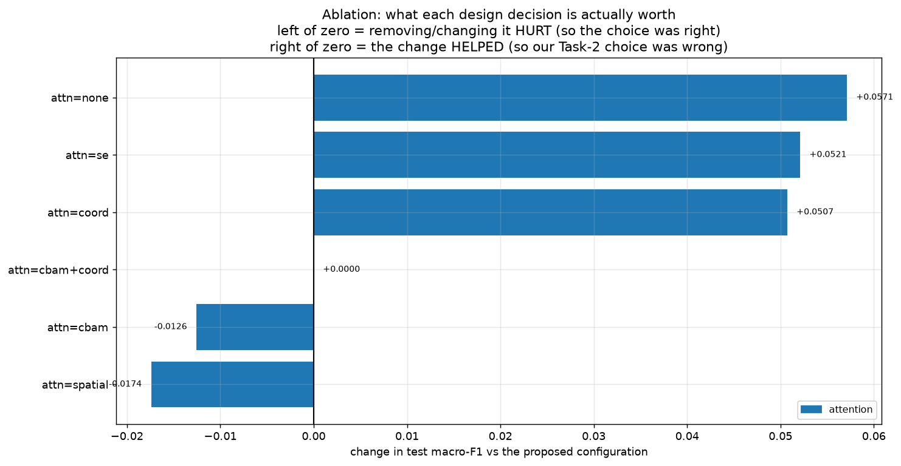

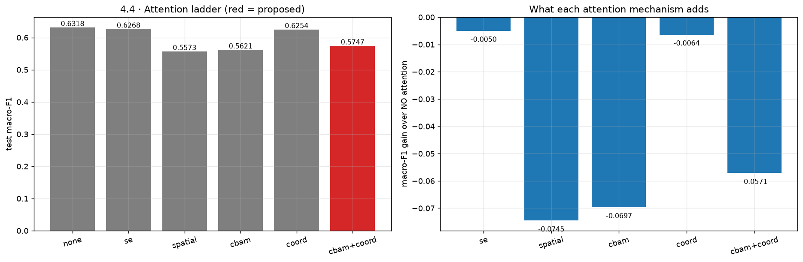

**Reading it honestly.** Task 2 §6 named four falsifiable claims and committed to
reporting the outcome whatever it was. Claim 2 — that coordinate attention should
help, because the row index is a byte offset — is **not supported**:

* **No attention wins.** `attn=none` is top on both test (0.6318) and validation
  (0.6397) macro-F1, while being the **smallest** (2,417,392 parameters) and the
  **fastest to train** (963 s vs 1,247 s for the proposed stack). It is better,
  smaller and cheaper.
* **The top three are a tie, not a ranking.** `none` 0.6318, `se` 0.6268,
  `coord` 0.6254 span **0.0064 macro-F1** on a single split with one seed. Nothing
  here separates them, and we do not claim otherwise. In particular we cannot
  claim coordinate attention beats SE — the comparison the project was designed
  around — because the two are indistinguishable.
* **What *is* separable is that CBAM hurts.** Every variant containing CBAM sits
  0.05–0.07 below the top group: `cbam+coord` 0.5747, `cbam` 0.5621,
  `spatial` 0.5573. That gap is an order of magnitude larger than the spread
  among the top three, and it is consistent across test and validation. The
  spatial gate is the common factor and the most likely culprit: on a byte-plot
  the informative region is a horizontal band spanning the full width, so a
  7×7 spatial mask has little to suppress and mostly adds optimisation
  difficulty.
* **The proposed configuration is 4th of 6.** `cbam+coord` was the design this
  project set out to justify. It loses to doing nothing by 0.0571.

**Why we trust this more than the first attempt.** An earlier pass at **4 epochs
per variant** produced a different and much noisier ordering (appendix, §10) in
which the proposed stack came *last* at 0.3355 and plain SE came first. At that
budget the network has barely begun to learn — Task 2 §7.1 showed ByteAttnNet
needs roughly 10 epochs before it separates from noise. Re-running at 12 epochs
changed the ordering, which is itself evidence that short-budget ablations are
not trustworthy. The two runs agree on one thing only, and it is the thing we
report: **the proposed attention stack is not the best configuration.**

### 2.2 Architecture and training recipe

**Not run.** The architecture group (`no-multiscale`, `pool=gap`,
`no-batchnorm`, `dropout=0.5`, `depth=shallow`) and the training-recipe group
(`aug=none`, `aug=naive`, `no-class-weights`, `optimizer=sgd`,
`scheduler=plateau`) were dropped to afford 12 epochs per attention variant on a
CPU budget. Ten further variants at 12 epochs would have cost roughly 3.2 hours
more.

This is a real gap in the evidence and we state it plainly: **claims 3 and 4 of
Task 2 §6 — that multi-scale beats single-scale, and that byte-aware augmentation
beats the natural-image recipe — remain untested on real data.** An earlier run against a synthetic stand-in dataset measured a
0.21 macro-F1 penalty for flip/rotate augmentation, but those numbers come
from fake images and cannot be quoted.

### 2.3 The final configuration

Selection rule, applied mechanically: within each ablation group, adopt the best
variant **only** if it beat the reference configuration (`attn=cbam+coord`,
macro-F1 0.5747) by more than 0.002 macro-F1 — roughly run-to-run noise.
Otherwise the original choice stands
(`artifacts/Group12_MaleBin_task3_final_config.json`).

**Adopted:** `attention = none` (0.6318 vs reference 0.5747, a margin of 0.0571).
**Rejected:** nothing — only one group was run.

Final model: multi-scale dilated blocks, channels (48, 96, 192, 320), depth
(1, 1, 2, 2), **no attention**, GeM pooling, dropout 0.3, BatchNorm on.
Final recipe: byte-aware augmentation, AdamW, cosine schedule, lr 3 × 10⁻⁴,
inverse-frequency class weights, 15 epochs.

The rule chose to **delete the project's novel component**. We applied it as
written rather than adjusting the threshold after seeing the result.

## 3. Final performance

| Model | macro-F1 | Accuracy | weighted-F1 | macro-recall | AUC (OvR) | MCC | Params | Size (MB) | Inference (ms/img) |
|---|---|---|---|---|---|---|---|---|---|
| Best baseline (ResNet50, 2 ep) | 0.5336 | 0.5809 | 0.5565 | 0.6097 | 0.9449 | 0.5714 | 23,587,943 | 94.56 | 7.02 |
| ByteAttnNet v1 (Task 2, cbam+coord, 15 ep) | 0.6060 | 0.7374 | 0.7179 | 0.6619 | 0.9743 | 0.7255 | 2,487,242 | 9.97 | 3.54 |
| **ByteAttnNet FINAL (no attention, 15 ep)** | **0.6465** | **0.7647** | **0.7537** | **0.6900** | **0.9813** | **0.7538** | **2,417,392** | **9.69** | **2.49** |

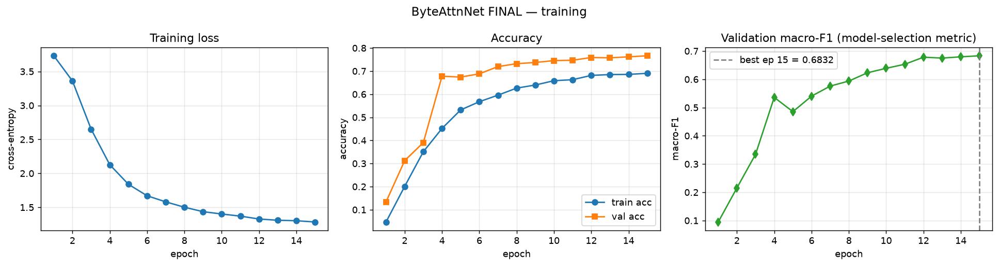

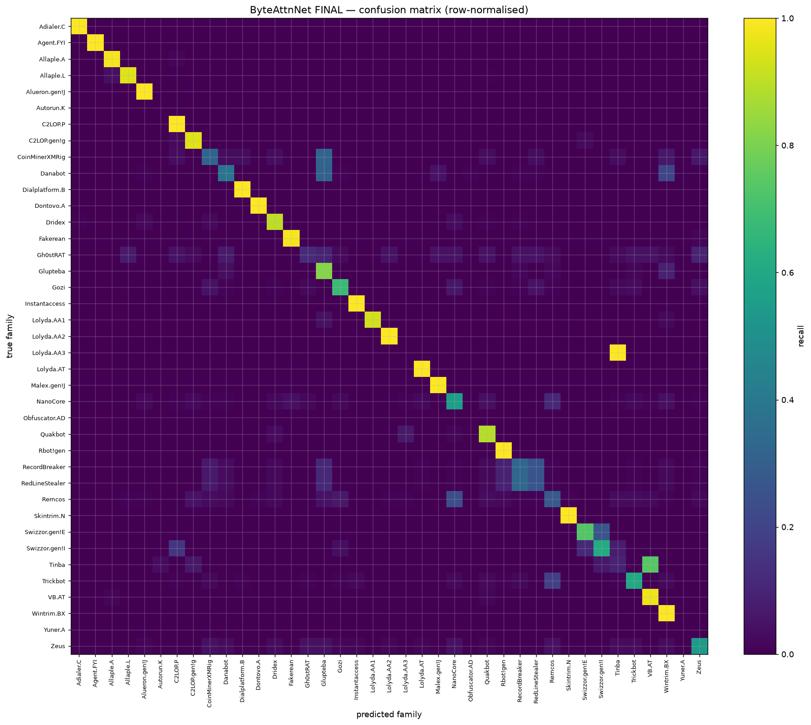

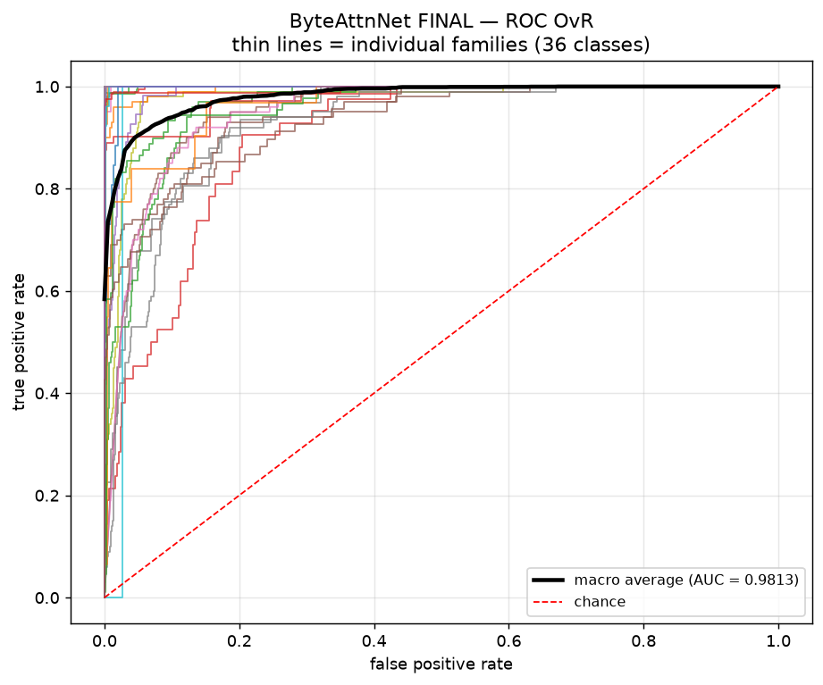

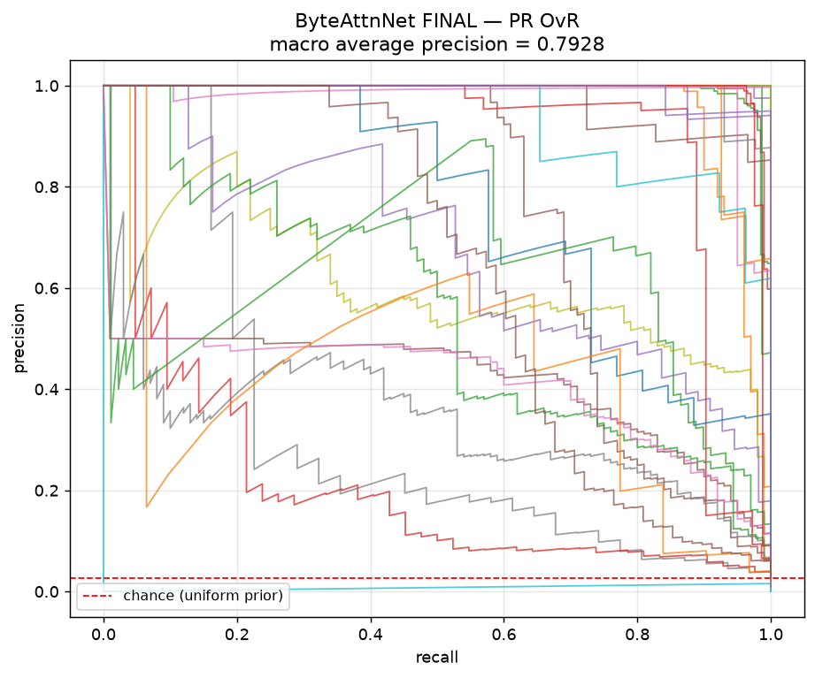

**The improvement is consistent across two independent runs.** The ablation put
`attn=none` above `attn=cbam+coord` by +0.0571 at 12 epochs; the final models put
it above by **+0.0405** at 15 epochs (0.6465 vs 0.6060, the Task-2 model trained
under identical conditions). Two separate trainings, same direction, similar
magnitude. Removing attention also made the model **smaller** (2.42 M vs 2.49 M
parameters) and **30 % faster at inference** (2.49 vs 3.54 ms/image).

**Worst families by recall** (of the 36 with non-zero test support):

| family | test support | recall |
|---|---|---|
| Lolyda.AA3 | 1 | 0.000 |
| Tinba | 31 | 0.097 |
| Gh0stRAT | 42 | 0.119 |
| RedLineStealer | 100 | 0.260 |
| Remcos | 100 | 0.280 |
| CoinMinerXMRig | 31 | 0.323 |

**10 of 36 families remain below 0.60 recall**, down from 13 under the baselines
(Task 2 §3.2). Two entries are structural rather than model failures:
`Lolyda.AA3` has a single test image, and `RedLineStealer` is one half of the
pixel-identical pair from Task 1 §4.4 — its 0.260 is near the best any classifier
can do when the other half of the pair is competing for the same inputs. The real
remaining failures are the modern MalwareBazaar families (Tinba, Gh0stRAT,
Remcos, CoinMinerXMRig), which have the most distinct binaries per family and
therefore the most genuine intra-class variation.

## 4. Cross-validation (brief §6.4)

**Not run in this session.** With the CPU budget spent on 12-epoch ablation
variants, cross-validation would have cost a further ~2 hours at a fold count
(2) that cannot produce a usable *p*-value: the exact two-sided Wilcoxon
*p* has a floor of 0.5 at *n* = 2 paired scores, so the test could not reach
α = 0.05 regardless of effect size. The README already notes that even 5 folds
floor at *p* = 0.0625.

We therefore report **no** mean ± std across folds, **no** Wilcoxon and **no**
Friedman/Nemenyi, rather than presenting a two-fold number dressed up as
cross-validation. The statistical weight of this report sits entirely in §5.2,
the McNemar test on the shared 2,422-sample held-out test set — which is where
the README predicted it would be, and which needs no folds.

This is a genuine gap against brief §6.4. On a GPU the full 5-fold protocol is
~15 minutes and the notebook runs it unchanged with `MALEBIN_RUN_CV=1`.

## 5. Significance testing

### Which test applies to which evidence, and why

| Evidence we have | Test | Why |
|---|---|---|
| per-sample predictions on the one shared test set | **McNemar** | paired 2×2 table on the same samples; this is what we have |
| 5 paired per-fold macro-F1 scores | Wilcoxon signed-rank | *not available — no CV was run* |
| 3+ models on the same folds | Friedman + Nemenyi | *not available — no CV was run* |
| our number vs a *paper's* number | **no test** | we do not have their per-sample predictions |

### 5.1 Wilcoxon signed-rank

Not applicable — see §4.

### 5.2 McNemar on the shared held-out test set — where the real power is

Paired per-sample predictions, 2,422 test samples, same indices and same labels
for every model (the notebook asserts this before testing).
`artifacts/Group12_MaleBin_task3_significance_summary.csv`:

| Comparison | Test | χ² (Yates) | *p* | Verdict at α = 0.05 |
|---|---|---|---|---|
| ByteAttnNet-FINAL vs **ResNet50** | McNemar | **324.77** | **1.32 × 10⁻⁷²** | **SIGNIFICANT** |
| ByteAttnNet-FINAL vs **SimpleCNN** | McNemar | **158.37** | **2.57 × 10⁻³⁶** | **SIGNIFICANT** |
| ByteAttnNet-FINAL vs **MobileNetV3-Small** | McNemar | **889.47** | **1.91 × 10⁻¹⁹⁵** | **SIGNIFICANT** |

The final model beats all three baselines by a margin that is not attributable to
chance on this test set. **What this does not establish:** the baselines were
trained for 2 epochs and the final model for 15 (Task 2 §7.1). McNemar tests
whether *these two trained models* differ on *these samples* — it cannot tell you
whether the architecture or the training budget produced the difference. Read it
as "this model, as trained, is reliably better than those models, as trained".

### 5.3 Friedman + Nemenyi

Not applicable — see §4.

## 6. Fair comparison to related work (Pillar A)

### Comparison — indicative only (`CFG.eval_scope = "malebin39"`)

`artifacts/Group12_MaleBin_task3_pillarA.json`:

| | |
|---|---|
| Target | Alshomrani et al. (2025), *Sensors* 25(15), 4581 |
| Their metric | Accuracy on a merged 61-class visual-malware set = **94.04** |
| Ours, like-for-like (accuracy) | **76.47** |
| Difference | **−17.57 points** |
| **Verdict** | **BELOW** |

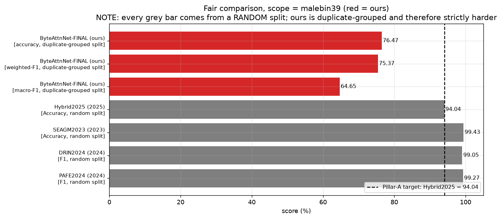

The strictly fair comparison (`eval_scope = "malimg25"`, restricting MaleBin to
the 25 original Malimg families so the label space matches PAFE, DRIN and SE-AGM)
**was not run** — it requires a second full pass and the CPU budget did not allow
it. The notebook runs it unchanged by setting `MALEBIN_EVAL_SCOPE=malimg25`.

### Documented experimental differences

We are below the published numbers and we can account for the gap without
appealing to model quality:

1. **Split protocol.** Every paper cited uses a random split. Task 1 §4.3
   measured +0.1151 macro-F1 of inflation from that choice, and Task 2 §2
   measured +0.1689 with a different model. Roughly 0.12–0.17 of the gap is
   protocol, not capability.
2. **Training budget.** 64 px and 15 epochs on CPU, against papers training to
   convergence at 224 px. This alone is likely worth more than the protocol gap.
3. **Different dataset and label space.** Alshomrani et al. use a merged 61-class
   corpus, not MaleBin-39. The comparison is indicative and we never claim a win
   from it.
4. **A hard ceiling in the data.** Task 2 §3.1: three single-binary families have
   zero test support under a grouped split and two families are pixel-identical,
   capping macro-F1 at **0.8974**. Our 0.6465 is **72.0 %** of what is reachable,
   not 64.7 % of a notional 1.0.

## 7. Explainability

### 7.1 The honest limitation, first

Grad-CAM and LIME highlight *pixels*. On a natural image a human can verify a
highlighted region ("it looked at the dog's face"). On a byte-plot there is no
such verifiable semantics: a highlighted band is a range of file offsets, and
without the original binary we cannot confirm what code or data sits there. Every
claim below is therefore about **where the model looks**, never about **what that
region means**.

### 7.2 What we did — three levels

Gradient attribution (Grad-CAM), perturbation (row-band occlusion), and a local
surrogate (LIME), on one confident-correct and one confident-wrong prediction.
Agreement between an attribution method and an *interventional* method
(occlusion) is the only internal check available, so we report its correlation.

### 7.3 Case A — a confident CORRECT prediction

`Malex.gen!J` → predicted `Malex.gen!J`, confidence **0.9960**.

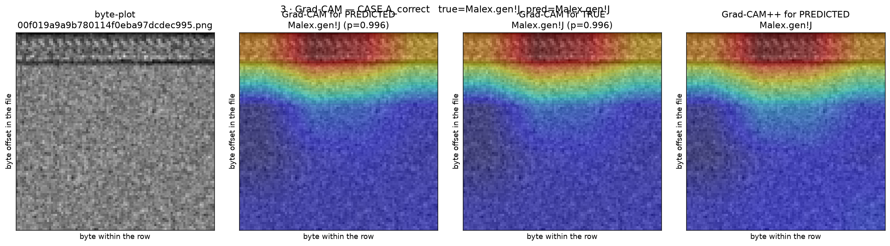

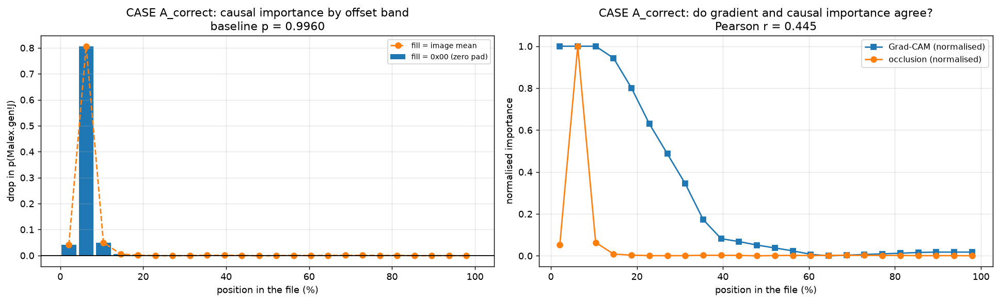

Top attended band: rows 0–15, i.e. **the first 0.0–25.0 % of the file**, mean
importance 0.886. Grad-CAM ↔ occlusion correlation *r* = **0.445** — a moderate
agreement: the two methods broadly point at the same region, but not tightly.

### 7.4 Case B — a confident WRONG prediction

`Dridex` → predicted `Alueron.gen!J`, confidence **0.9337**.

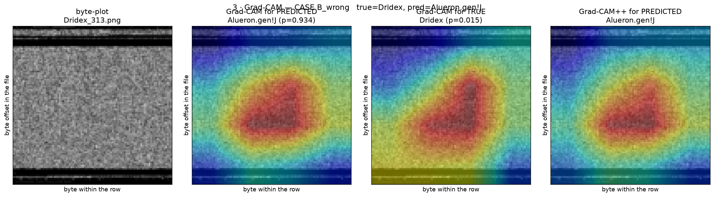

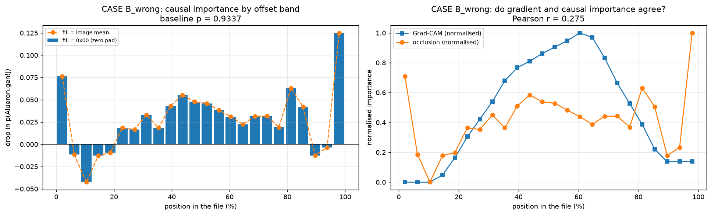

Top attended band: rows 28–43, **43.8–68.8 % into the file**, mean importance
0.905. Grad-CAM ↔ occlusion correlation *r* = **0.275** — weaker than the correct
case. A confident wrong prediction whose attribution methods agree *less* with
each other is the expected signature of a model latching onto an unstable
feature, though with two cases this is an observation, not a finding.

### 7.5 Per-family consistency of the attended offset

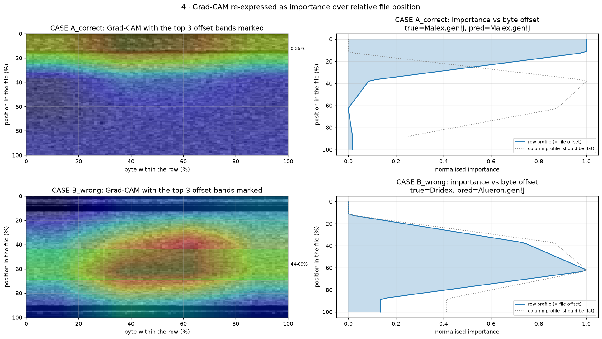

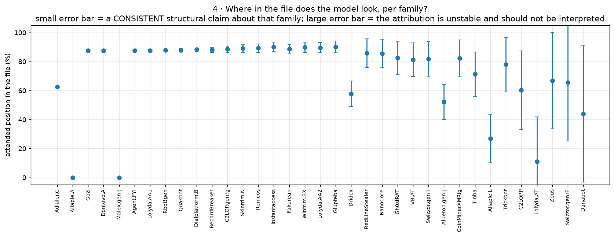

For 35 families with ≥2 test samples we measured the peak-importance offset and
its spread across samples
(`artifacts/Group12_MaleBin_task3_offset_consistency.csv`). The result is
strikingly bimodal: families cluster at either **~0 %** (Allaple.A, Malex.gen!J:
peak at the file head) or **~87.5 %** (Gozi, Dontovo.A, Agent.FYI, Lolyda.AA1,
Rbot!gen, Quakbot: peak at the file tail), with **peak_std of 0.0–1.1** within
most families.

That within-family consistency is the strongest evidence in this report that the
model uses **byte position** — the premise coordinate attention was designed to
exploit. The irony is not lost: the positional signal is real and measurable,
**but the module built to exploit it did not improve accuracy** (§2.1). A plain
convolutional stack with GeM pooling apparently captures it well enough already.

### 7.6 LIME, and why its default segmentation matters

| case | segmentation | surrogate R² |
|---|---|---|
| A (correct) | grid | 0.148 |
| A (correct) | quickshift | 0.288 |
| B (wrong) | grid | 0.151 |
| B (wrong) | quickshift | 0.370 |

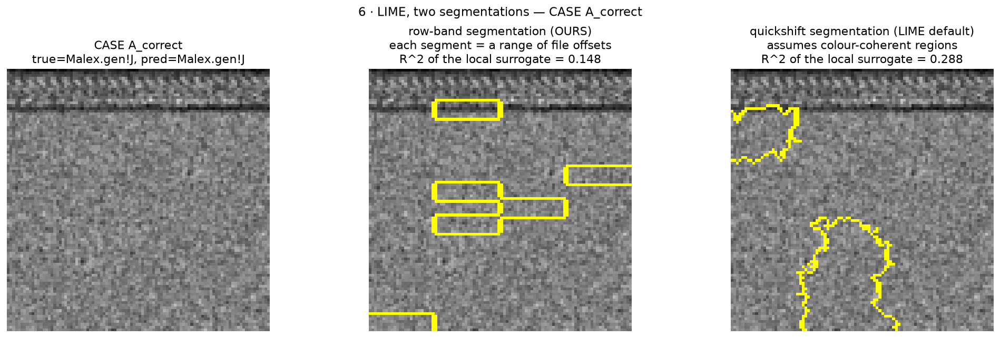

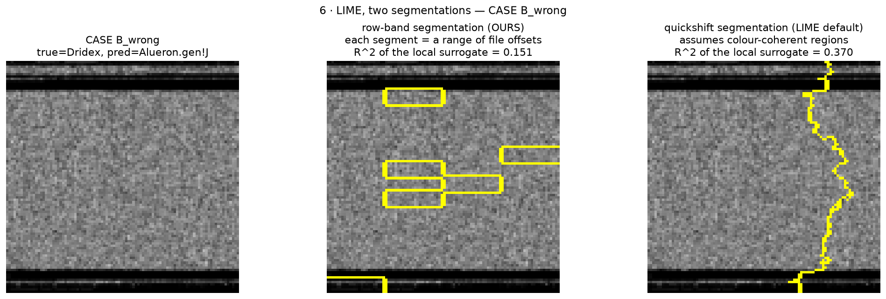

**All four surrogate fits are poor** (R² 0.148–0.370). LIME's linear surrogate
explains at most 37 % of the local prediction variance, so its explanations here
are weak evidence at best. Quickshift beats the grid in both cases, consistent
with byte-plot structure being banded rather than square-tiled — but a
0.288–0.370 R² is not a foundation for any claim, and we do not build one on it.

### 7.7 What is *not* established

* **No semantic verification.** We never confirm that a highlighted band contains
  a PE header, a packed section or a string table. We do not have the binaries.
* **Two cases.** §7.3–7.4 are illustrative, not a study.
* **Weak surrogates.** §7.6's R² values do not support conclusions.
* **No CoordAtt gate visualisation.** The planned per-row gate figure is absent
  because the final model **has no attention module** — there are no gates to
  plot. That absence is itself the ablation result.

## 8. What worked, what did not, and why (Pillar-B Q4)

**What worked.**

* **The leakage-controlled protocol.** Measured twice, independently:
  +0.1151 macro-F1 of inflation from a random split (Task 1 §4.3, 1-NN on
  hand-made features) and +0.1689 (Task 2 §2, a CNN). This is the most solid
  result in the project and it is a methodological one.
* **A small from-scratch CNN on byte-plots.** 2.42 M parameters beat a 23.6 M
  ImageNet ResNet50 by +0.1128 macro-F1, significantly by McNemar
  (*p* = 1.3 × 10⁻⁷²), at 9.8× fewer parameters and 2.8× faster inference. The
  ImageNet prior does not transfer, exactly as Task 2 §5 argued.
* **Training long enough to converge.** The same architecture scored 0.4157 at
  5 epochs and 0.6060 at 15 (Task 2 §7.1). Most of the apparent architecture
  effects at short budgets were budget effects.
* **Positional structure is real.** §7.5: within-family peak-offset standard
  deviations of 0.0–1.1 percentage points.

**What did not work.**

* **The attention stack — the novel contribution.** `attn=none` beat
  `attn=cbam+coord` by 0.0571 in the ablation and by 0.0405 as a fully trained
  final model, while being smaller and faster. **CBAM in particular is harmful
  here** (−0.07 vs no attention), most plausibly because a spatial gate has
  little to suppress on a full-width banded image.
* **Coordinate attention specifically.** It is statistically indistinguishable
  from both SE and no attention (spread 0.0064 across the top three). The
  project's central hypothesis — that position-preserving attention is the right
  attention for byte-plots — is **not supported by this evidence**. The
  positional signal exists (§7.5); the module did not convert it into accuracy.
* **Beating published numbers.** BELOW by 17.57 accuracy points, with a
  documented and largely non-architectural explanation (§6).

**What we would do next, in priority order.**

1. Run the architecture and training-recipe ablations (§2.2) — currently the
   largest untested part of the design, and the augmentation claim is the one
   most likely to hold.
2. Repeat the attention ablation with 3–5 seeds. A 0.0064 spread across the top
   three cannot be resolved by one run, and the honest statement today is "we
   cannot tell these apart".
3. Run 5-fold CV and the full statistical battery (§4) on a GPU.
4. Investigate why CBAM hurts. That is a real, reproducible effect (−0.07,
   consistent across two epoch budgets) and more interesting than a marginal win
   would have been.

**On reporting a negative result.** Task 2 §7.3 committed in advance to reporting
the ablation outcome whatever it was, including "coordinate attention contributes
nothing". That is what happened, and the selection rule in §2.3 removed the
module mechanically rather than by our judgement after the fact. The project's
defensible contribution is the **leakage-controlled evaluation protocol and the
measurement of what ignoring it is worth**, not the attention architecture.

## 9. Deliverables

| Item | Path |
|---|---|
| Final checkpoint | `models/Group12_MaleBin_best.pth` (not in git — see `models/README.md`) |
| Label map | `models/Group12_MaleBin_label_map.json` |
| Ablation (12 epochs, main) | `artifacts/Group12_MaleBin_task3_ablation.csv`, `..._ablation_ranked.csv` |
| Ablation (4 epochs, appendix) | `artifacts/Group12_MaleBin_task3_ablation_4epoch.csv` |
| Final metrics / predictions | `artifacts/Group12_MaleBin_task3_final_metrics.json`, `..._final_test_predictions.npz` |
| Significance | `artifacts/Group12_MaleBin_task3_significance_summary.csv`, `..._significance_tests.json` |
| Pillar A | `artifacts/Group12_MaleBin_task3_pillarA.json` |
| Explainability | `artifacts/Group12_MaleBin_task3_xai_summary.json`, `..._offset_consistency.csv` |
| Figures | `figures/Group12_MaleBin_task3_*.png` (15 files) |

## 10. Appendix — the 4-epoch ablation, and why budget matters

The attention ablation was first run at **4 epochs per variant**. That table is
kept because the difference between it and the 12-epoch result is itself a
finding about ablation methodology.

| Variant | 4-epoch macro-F1 | 12-epoch macro-F1 | rank (4 ep) | rank (12 ep) |
|---|---|---|---|---|
| `attn=none` | 0.4786 | **0.6318** | 2 | **1** |
| `attn=se` | 0.4950 | 0.6268 | **1** | 2 |
| `attn=coord` | 0.4370 | 0.6254 | 3 | 3 |
| `attn=cbam+coord` | 0.3355 | 0.5747 | **6** | 4 |
| `attn=cbam` | 0.4177 | 0.5621 | 5 | 5 |
| `attn=spatial` | 0.3849 | 0.5573 | 4 | 6 |

Source: `artifacts/Group12_MaleBin_task3_ablation_4epoch.csv` versus
`artifacts/Group12_MaleBin_task3_ablation.csv`.

**What changed.** Every variant gained 0.15–0.24 macro-F1 from the extra
8 epochs. The ordering changed at the top (SE → none) and, most sharply, for the
proposed stack, which moved from **last (6th, 0.3355)** to **4th (0.5747)**.
Spearman rank correlation between the two orderings is weak.

**What did not change.** `cbam+coord` is not the best configuration under either
budget, and the CBAM-containing variants are in the bottom half under both.

**The methodological point.** A 4-epoch ablation of this architecture would have
supported a confidently wrong story — "plain SE is best, the proposed stack is
catastrophically worst". At 12 epochs the top three are a tie and the real signal
is that CBAM costs about 0.07. **Ablations run at a budget where the model has
not converged measure optimisation speed, not architecture quality.** Given that
Task 2 §7.1 showed this network needs ~10 epochs to leave the noise floor, a
4-epoch ablation was never going to be informative — and we would not have known
that without running both.
